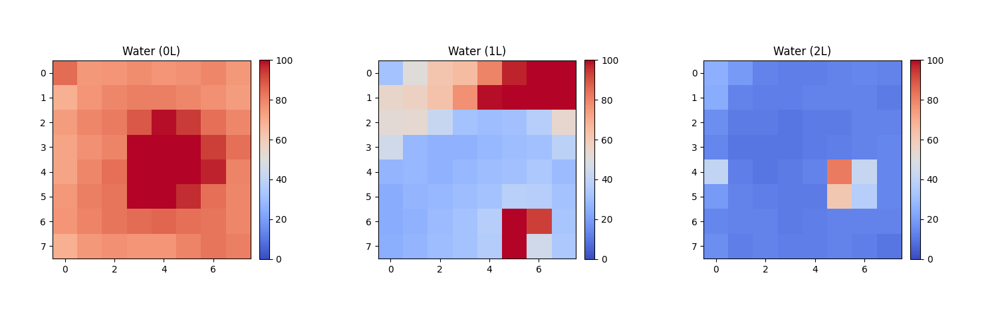
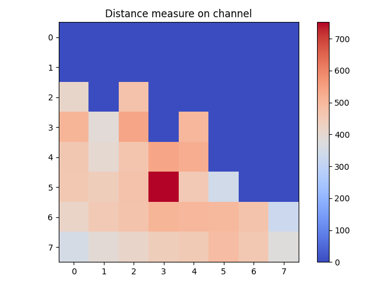

# Étude de la réflectivité de l'eau

## Organisation du répertoire : 

Le répertoire du projet est constitué de la manière suivante :
- ./0_Programs : Contient l'ensemble des programmes python et C++. 
- ./1_Pictures : Contient les résultats des expériences.
- ./2_Data : Contient les donneés brutes récupérées par durant les expériences. 

## Expériences :

L'objectif de ces expériences est de mesurer la **réflectivité de l'eau** vis à vis du rayon infrarouge émis par le capteur Tof. Deux expériences ont été réalisé, la première a permi de découvrir l'impact du volume d'eau sur la réflectivité et la seconde la réflectivité dans un cas réel, directement sur le canal. 

Le code `Mean_on_reflectance_calculation.cpp` est le code envoyé dans le carte *STM32 L476RG* pour la première expérience. Il suffit pour l'utiliser de copier son contenu dans le fichier `main.cpp` de votre projet.    

La seconde expérience nécessite l'usage du code `Mean_on_distance_calculation.cpp`.

### Expérience 1 - Test de réflectivité dans un récipient

L'objectif de cette expérience est d'obtenir un premier aperçu de la variation de réflectivité induite par l'eau, en fonction du volume. Pour la réaliser, le capteur a été positionné verticalement au dessus d'un récipient rempli d'eau, de tel sorte que les rayons lumineux se disperse le moins possible et atteignent tous la surface de l'eau.   

**Choix du récipient :**

Le premier récipient utilisé était une casserole pour sa praticité d'usage et son volume. Cependant, le capteur renvoyait des valeurs étrangements faible, peu importe la quantité d'eau. Après comparaison avec un récipient en verre, il s'est avéré que la casserole fonctionnait comme un guide d'ondes pour les rayons infrarouges. Pour écarter ce problème, l'expérience a été réalisée avec un bol en verre. 

**Acquisition :**

La carte électronique génère au bout d'une dizaine de secondes une liste de 64 valeurs.  Chaque valeur est la moyenne des résultats pour un point d'acquisition sur 10s. Les résultats sont stockées dans le dossier `./2_Data`.   

**Résultats :**

Les résultats précédents sont traités par le programme python `E1_display_water_reflexion_results.py`. Ce dernier génère à partir de ces données des matrices. Elles sont stockées dans le dossier `./1_Pictures` avec le préfixe `E1_`. Chaque carré est une cellule d'acquisition du récepteur.   

La réflectance s'exprime en pourcentage et représente la part d'énergie qui a été réfléchie par la surface et qui est retournée vers la cellule d'acquisition. On remarque qu'**initialement**, la **réflectance est quasi-totale**. Néanmoins, dès qu'on **ajoute de l'eau** cette dernière chute jusqu'à être **quasiment nulle**.   

_Données associées :_ 
- reflectance_0.5L_waveguide_issue.txt
- reflectance_2L_waveguide_issue.txt
- reflectance_4L_waveguide_issue.txt
- reflectance_no_water.txt
- reflectance_1L.txt
- reflectance_2L.txt

### Expérience 2 - Test de réflectivité dans le canal

**Environnement de test :**

Les résultats de l'expérience précédente ont révélé que plus il y avait d'eau, plus la réflectivité était faible. Cette deuxième expérience vise à étudier la réflectance en milieu réel. Elle a été réalisé sur le **Canal de Provence** ([43.441339, 5.488827](https://www.openstreetmap.org/search?lat=43.441339&lon=5.488827&zoom=19#map=19/43.441339/5.488827)) à proximité de l'école. 

Le capteur a été disposé sur l'une des berges, tête en direction de l'eau. Il était à moins d'un mètre de la surface. La mesure a permi d'établir la matrice suivante. 

Les résultats sont traités par le programme python `E2_test_on_channel.py`.

**Observations :**

La moitié des rayons, ici la partie basse de l'image, se sont réfléchis sur le parapet en béton du canal. La réflectance a été suffisante pour qu'ils renvoient une distance chiffrée. La seconde partie des rayons se sont réfléchis sur l'eau. Le capteur a transmis pour chacune de ces positions, une valeur 0. 

Ce comportement a lieu si aucun rayon ne revient en direction du capteur, car la surface est trop lointaine, ou dans le cas, où la réflectance est nulle. Dans le cas de cette expérience, le capteur est à moins d'un mètre de la surface acqueuse. Ainsi, l'eau a absorbé tous les rayons.

_Données associées :_ 
- channel_water_test.txt
- sky_test.txt