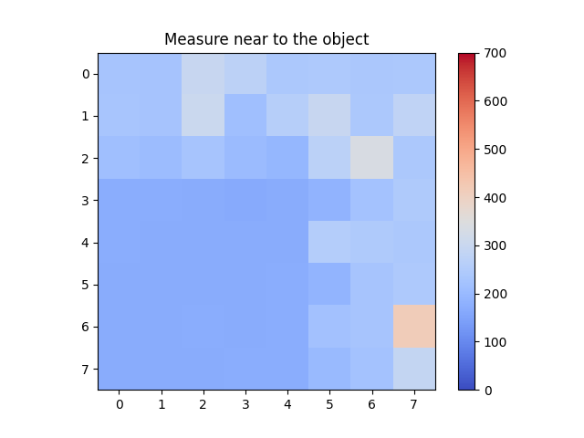
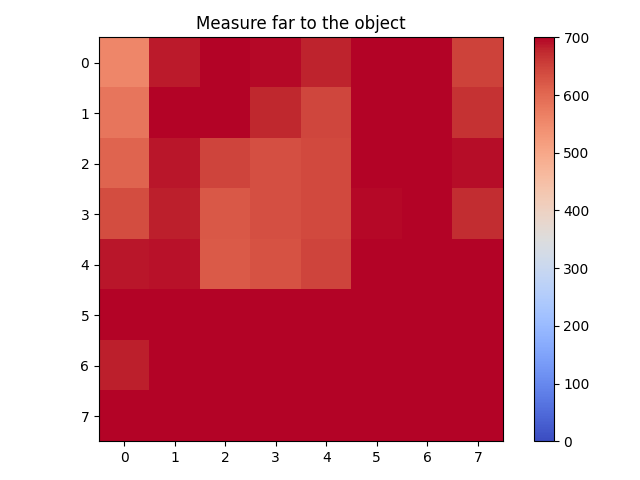
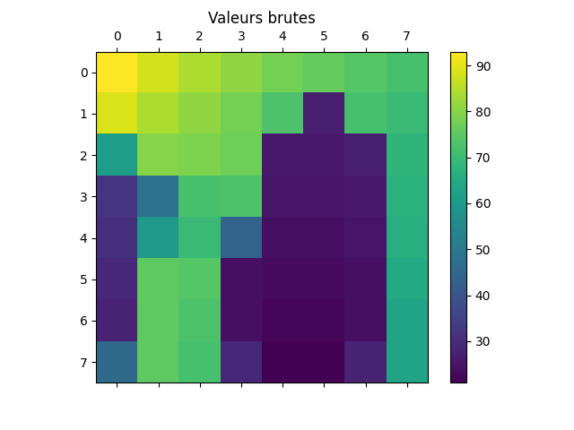
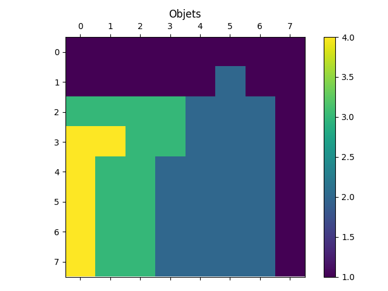
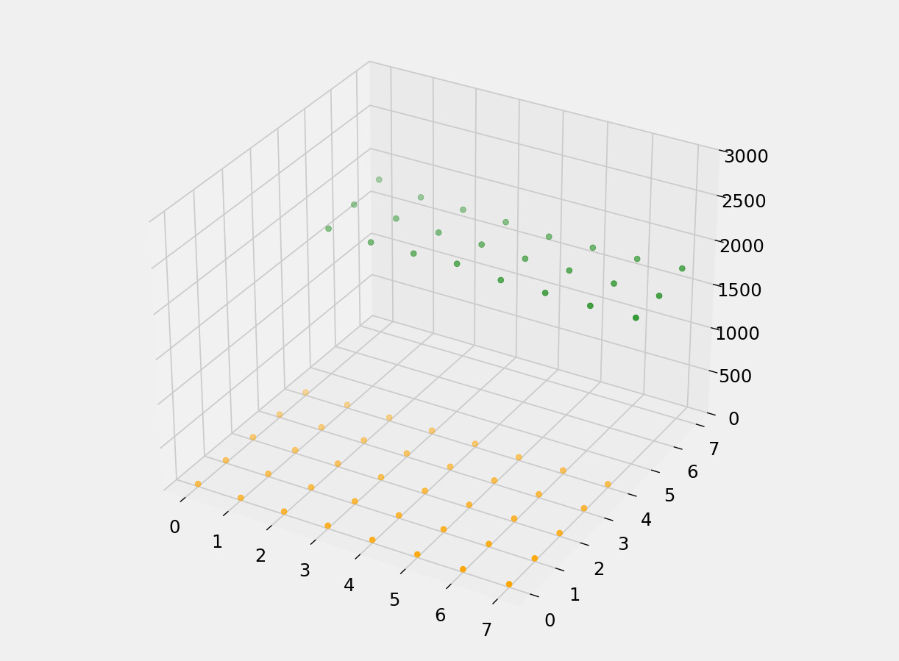

# Acquisition et traitement des données du capteur en temps réel

## Organisation du répertoire : 

Le répertoire du projet est constitué de la manière suivante :
. \
├── 0_Static : Contient les pré-codes pour tester les fonctionnalités sur des données statiques avant l'implémentation dynamique. \
│   ├── 0_Programs : Algorithme C++ et Python \
│   ├── 1_Data : Données récoltées pour tester les foncionnalités \
│   └── 2_Pictures : Matrices résultats. \
├── 1_Dynamic : Contient les codes d'acquisition et de traitement en temps réel. \
│   ├── 0_Without_obj_detect : Acquisition en temps réel et affichage sans traitement dans une matrice 3D. \
│   ├── 1_With_obj_detect : Acquisition en temps réel, identification des objets puis affichage dans une matrice 3D. \
│   ├── 2_With_distances_between_points : Acquisition en temps réel, identification des objets puis affichage dans une matrice 3D en prenant en considération la résolution. \
│   └── 3_With_rotation : Acquisition en temps réel, identification des objets puis affichage dans une matrice 3D avec la rotation autour d'un axe.

## Section statique

**Algorithmes :**
- `print_values.py` : Lit le fichier de données et affiche les valeurs dans une matrice 8x8.  
- `detect_object.py` : Détecte les objets présents dans les données à l'aide d'une heuristique. 
- `detect_movement.py` : Détecte les objets et leur barycentre à l'aide d'une heuristique.  

Le code `get_mean_distances.cpp` est le code envoyé dans le carte *STM32 L476RG* pour récupérer les données nécesaires aux algorithmes de la section. Il suffit pour l'utiliser de copier son contenu dans le fichier `main.cpp` de votre projet. 

**L'impact de la distance sur la résolution :**

Les nouvelles fonctionnalités, comme l'affichage 3D et la détection d'objets sont initialement développées et testés sur des données que nous avons récoltés. Le dossier `Distance_problem` contient les mesures receuillies à différentes distances d'objets. L'objectif était d'étudier l'impact de la résolution sur la détection. 

Plus l'objet **est lointain**, plus **la résolution est faible**, car la zone d'émission est plus grande, ce qui peut être assimilé à un écartement des points d'acquisition.  

Cette première capture réalisée à une vingtaine de centimètres de l'objet. On y détecte aisément la forme de l'objet de la cellule 3,0 à la cellule 7,4.  

Néanmoins, sur cette seconde illustration prise à un peu plus d'un mètre de l'objet, il est impossible de le détecter. 

Le dossier `Objects_movement` contient les données pour la détection d'objets et de barycentre. Initialement, l'algorithme récupère les valeurs brutes de distances (voir première image). À partir d'une heuristique simple, il détecte pour chaque point ses voisins et lui attribue une valeur. Cette valeur désigne son groupe potentiel. Les groupes sont ensuite affichés avec des couleurs (voir deuxième image). Un autre algorithme basé sur la même heuristique calcule le barycentre de chacun de ces groupes. En comparant la position des barycentres pour deux captures proches, on peut déduire la vitesse de l'objet.    

## Section dynamique

Cette section est l'application sur un flux de données temps réel des opérations de la section statique. Chaque algorithme `C++` renvoit les valeurs nécessaires à l'algorithme `Python` lié. Cet algorithme affiche les valeurs dynamiquement dans une matrice 3D. L'échelle est en milimètre pour l'axe z et en identifiant de cellules pour l'axe x et y.  

**Dossiers :**
- ./0_Without_obj_detect : Récupération des données de la `carte ST L476RG`, réflectances ou distances et affichage en 3D. 
- ./1_With_obj_detect :  Récupération des données (distances mesurées) de la `carte ST L476RG`, traitement pour détecter les objets et affichage en 3D.  
- ./2_With_distances_between_points : Récupération des données (distances mesurées), traitement pour détecter les objets et affichage en prenant en considération la distance entre les points d'acquisition (répartition homogène).   
- ./3_With_rotation : Identique à précédemment, mais à l'aide d'une matrice de rotation, le capteur tourne dans l'espace. 

**Cas particulier de `1_With_obj_detect` :**

Pour utiliser le code Python `real_time_display_obj.py`, il convient d'utiliser le code C++ `real_time_acquisition.cpp` du dossier précédent. Le code C++ `3D_with_detection_objects.cpp` est une convertion du code Python en C++ pour détecter les objets directement sur la carte sans nécessiter un ordinateur. Le code Python `real_time_display_obj_from_C.py` permet d'afficher les résultats du code précédent.   

