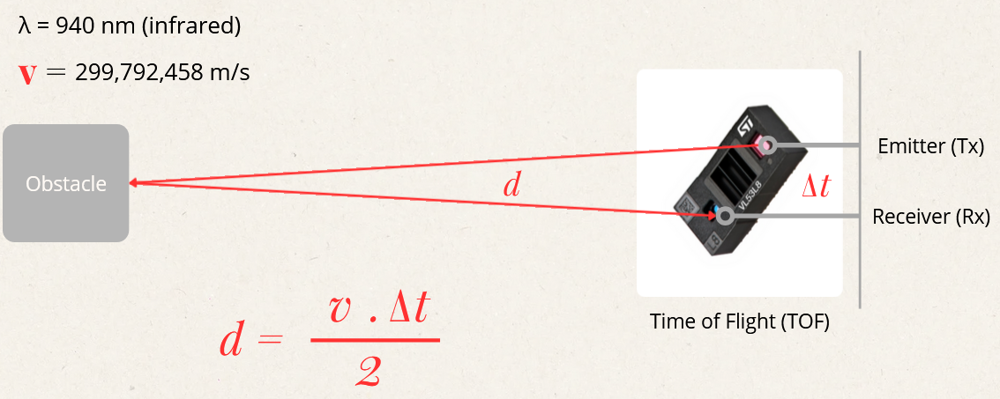

# Projet recherche 2026 - Capteur de débit d'eau sans contact

Ce projet s'inscrit dans le cursus d'ingénieur ISMIN (_Ingénieur Systèmes Microélectronique et Informatique_). 

## Auteurs
- École des Mines de Saint-Étienne - Étudiant ISMIN : Lucas VINCENT
- École des Mines de Saint-Étienne - Étudiant ISMIN (Double-diplôme) : Reem AL HADDAD

## Contexte

En France, 12% de l'irrigation est réalisée par irrigation gravitaire. Ce procédé repose sur un réseau de canaux de tailles diverses qui distribue l'eau grâce à la différence d'altitude entre l'amont et l'aval. Cette technique ancestrale a notamment permis d'irriguer des terres arides dans le sud de la France, comme la *La Plaine de La Crau*. 

Le dérèglement climatique nous impose de repenser notre utilisation de l’eau. De manière à raisonner son usage et mettre en place les mesures adaptés. Ainsi, il est nécessaire d'établir une surveillance préalable de ces canaux. Pour obtenir le maximum d'informations à l'échelle la plus large possible. Les chercheurs déploient des réseaux de capteurs intelligents le long des cours d'eau.

Traditionnellement, les systèmes employés sont mécaniques et immergés. Cependant, les canaux sont des
milieux à ciel ouvert où transitent une multitude de débris, dont des branches, des feuilles ou des sédiments. Ces perturbations rendent les capteurs immergés peu efficaces, car elles peuvent les bloquer ou les endommager. 

L'alternative actuelle est d'utiliser des capteurs basés sur la technologie radar, entre 10 et 80GHz. Ces derniers sont peu sensibles à la qualité de l'eau ou la présence d'algues et de sédiments. Ils admettent aussi une excellente précision et un faible entretien. Cependant, les objets en surface ou la turbulence des eaux affectent la fiabilité des résultat. De plus, le prix de ces capteurs pouvant atteindre plusieurs milliers d'euros, est un frein à leur déploiement à grande échelle. 

## Capteur `Time-of-flight`

Le projet est une exploration de l'intérêt d'un capteur `Time-of-flight` (TOF) dans l'acquisition du débit d'eau pour les canaux. Ce capteur est équipé d'un émetteur (Tx) et d'un récepteur (Rx). L'émetteur émet un signal infrarouge, qui est réfléchi par la surface, puis retourne dans le récepteur. La carte d'acquisition intégrée analyse la durée entre l'envoi et la réception et à partir de la vitesse de la lumière, constante dans l'air, elle déduit la distance entre le capteur et l'obstacle.     

Il existe deux types de capteurs `TOF` : 
- Simple : Acquisition d'un unique point.
- Multizone : Acquisition d'une matrice de points.

Nous avons utilisé le `TOF Multizone`, car il permet l'acquisition d'un échantillon de surface, plutôt qu'un unique point.

Sur le papier, il représente une alternative peu coûteuse financièrement et énergétiquement par rapport aux solutions à base de technologies radars actuellement développées. Cependant, nos recherches révèlent que son usage dans le milieu des canaux est **complexe**. 

Ce travail est inspiré de la vidéo [Turn a Time-of-Flight Sensor into a 3D Scanner](https://www.youtube.com/watch?v=s32OUzhjf4U). 

**Matériel utilisé :**
- Carte `Nucleo - STM32 L476RG`
- Capteur TOF Multizone `VL53L5CX` avec module SATEL
- Servomoteur `Microservo 9g`

| Pin      | Fonction      |
| ------------- | ------------- |
| PB9 | SDA - TOF |
| PB8 | SCL - TOF |
| PB0 | LPN - TOF |
| GND | I2C - RST |
| PB0 | LPN - TOF |
| PC0 | PWR_EN - TOF |
| 5V | AVDD |
| 3.3V | IOVDD |
| PB10 | Servo - PWM |

**Documentation :**  \
[1] VL53L8CX Datasheet, ST Microelectronics, 22 December 2022 . [En ligne]. Disponible suivant ce [lien](https://www.st.com/resource/en/datasheet/vl53l8cx.pdf)

[2] SparkFun_VL53L5CX_Library, SparkFun Electronics, No publication date. [En ligne]. Disponible suivant ce [lien](https://github.com/sparkfun/SparkFun_VL53L5CX_Arduino_Library)

[3] NUCLEO-L476RG Pinout, ST Microelectronics, No publication date. [En ligne]. Disponible suivant ce [lien](https://os.mbed.com/platforms/ST-Nucleo-L476RG/#overview)

## Arborescence du projet

Le projet est découpé en deux parties, l'étude de la réflectance de l'eau et l'acquisition et le traitement de données en temps réel. 

- ./0_Water_reflexion : Expériences sur la réflectance de l'eau. 
- ./1_Real_time : Acquisition en temps réel des données du capteurs, traitement et affichage dynamique. 
- ./2_3D_Object : Ensemble des modélisations 3D réalisées en support du projet. 
- ./3_Academic_documents : Rapport et diaporama en anglais détaillant le projet. 

Au vu de la durée du projet, nous avons préféré utiliser `PlatformIO` (similaire à `ArduinoIDE`) plutôt que `STM32 CubeIDE`. Le code est en `C++` et utilise la bibliothèque clef-en-main `SparkFun_VL53L5CX_Library` basée sur la bibliothèque de ST Microelectronics, [x-cube-tof1](https://github.com/STMicroelectronics/x-cube-tof1).  

## Phases du projet

**Phase 1 : Modélisation de la surface de l'eau**

La première approche a été d'essayer de modéliser la surface de l'eau. Le capteur est placé à un peu plus d'un mètre de la surface, de tel sorte que tous ses rayons soient réfléchis exclusivement par l'eau. Toutes les 10ms, il réalise une acquisition qui correpond à un échantillon de la surface de l'eau à l'instant t. En comparant les échantillons, on peut déduire une variation de hauteur et étudier l'aspect de la surface, potentiellement lié à la vitesse de l'eau. 

Malheureusement, nos expériences sur la réflectance de l'eau ont révélé qu'elle ne réfléchissait pas les infrarouges.  

**Phase 2 : Détection d'objets en surface**

L'eau absorbe l'intégralité des rayons infrarouges émis par le capteur. Ainsi, les objets en surface qui sont eux potentiellement réfléchissants peuvent être plus facilement détecté. Cela revient à placer un objet blanc sur une feuille noire. L'étude des mouvements des objets flottants, branches, feuilles et écorces serait une solution pour connaître la vitesse de l'eau en surface (dans un milieu où le vent est négligeable). 

Malheureusement, la précision du capteur décroit avec la distance et la résolution diminue avec l'éloignement. Ces deux phénomènes couplés rendent presque impossible la détection d'un objet à un mètre de distance. 

**Phase 3 : Mise en rotation du capteur**

Pour permettre la détection précise d'objet, il faut obtenir des points d'acquisition plus proche et augmenter leur nombre. L'utilisation de plusieurs capteurs risque de provoquer des interférences optiques qui peuvent impacter la qualité des résultats. La solution la plus simple serait de placer le capteur sur un axe en rotation, à l'aide d'un moteur asservi. Le pas du moteur dicterait alors la résolution. Cette méthode pourrait s'émanciper du capteur multizone 8x8 pour revenir sur un TOF simple.     

Cette phase n'a pas été achevée et reste à approfondir. 

## Conclusions

- L'eau absorbe les ondes infrarouges émisent par le capteur. Cette absorption est d'autant plus présente que le volume d'eau est important. Dans un canal, l'absorption est totale empêchant la prise de mesure à la surface de l'eau. Cette problématique oblige à détecter des objets en surface pour mesurer leur vitesse, plutôt que la surface de l'eau. 

- La résolution du capteur dépend de la distance. La zone d'émission est une pyramide d'angle 45°. Ainsi, plus la distance est importante, plus la distance entre deux points d'aquisition est grande. De plus, la précision décroit avec la distance. Ces deux phénomènes cumulés impactent la capacité à détecter des formes ou un objet à moyenne (1m) ou longue distance (2m). 

- Si le capteur est placé sur un moteur asservi, comme un servomoteur, il peut acquérir un plus grand nombre de points proches les uns des autres. Cette méthode permet d'améliorer la résolution et peut donc potentiellement corriger la problématique identifiée précédemment. 

## Ouverture 

Il existe une technologie similaire au TOF en rotation nommé le LiDAR (light detection and ranging). Ce dernier admet une meilleure résolution, permet une rotation à 360° avec une haute fréquence d'acquisition et est une technologie déjà fortement déployée dans l'industrie, notamment en navigation autonome. 

Cette piste semble donc être une nouvelle voie prometteuse d'analyse. Le capteur pourrait être placé au dessus du canal. Pour obtenir la vitesse de l'eau en surface, il mesurerait la vitesse des feuilles et branchages flottants. Pour mesurer la hauteur d'eau, il étudierait la berge et chercherait un saut de réflectance entre la béton et l'eau.
